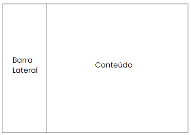
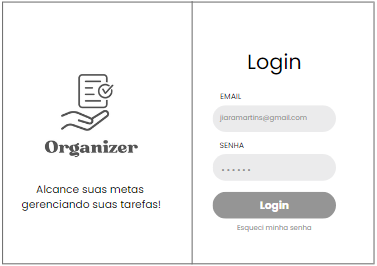
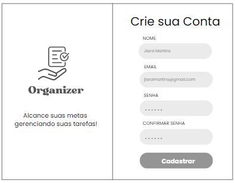
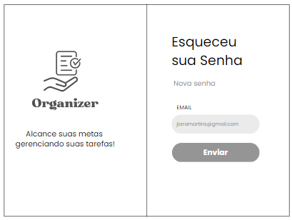
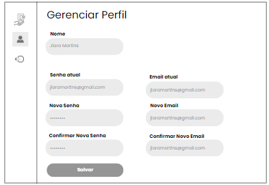
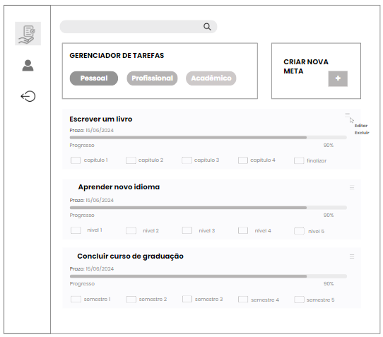
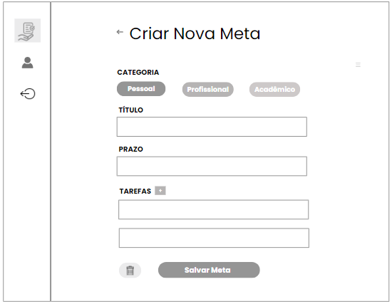

# ORGANIZER

`ANÁLISE E DESENVOLVIMENTO DE SISTEMAS`

`PROJETO DE DESENVOLVIMENTO DE UMA APLICAÇÃO INTERATIVA`

`2° SEMESTRE`

O projeto visa desenvolver um gerenciador de tarefas simples, prático e útil, focado em ajudar as pessoas a organizarem suas atividades.

## Integrantes

* Irene Aparecida Couto Ferraz
* Maria de Lourdes Monteiro da Silva
* Matheus Soares da Silva
* Raquel Nonato Silva
* Talita Fernandes Silva

## Orientador

* Bernardo Jeunon de Alencar

## Instruções de utilização

Assim que a primeira versão do sistema estiver disponível, deverá complementar com as instruções de utilização. Descreva como instalar eventuais dependências e como executar a aplicação.

Não deixe de informar o link onde a aplicação estiver disponível para acesso (por exemplo: https://adota-pet.herokuapp.com/src/index.html).

Se houver usuário de teste, o login e a senha também deverão ser informados aqui (por exemplo: usuário - admin / senha - admin).

O link e o usuário/senha descritos acima são apenas exemplos de como tais informações deverão ser apresentadas.

# ÍNDICE

<ol>
	
<li><a href="https://github.com/ICEI-PUC-Minas-PMV-ADS/pmv-ads-2023-2-e2-proj-int-t6-organizer/blob/main/README.md#documentacao"> Documentação</a></li>

<li><a href="https://github.com/ICEI-PUC-Minas-PMV-ADS/pmv-ads-2023-2-e2-proj-int-t6-organizer/blob/main/README.md#especificacao"> Especificação do Projeto</a></li>

<li><a href="https://github.com/ICEI-PUC-Minas-PMV-ADS/pmv-ads-2023-2-e2-proj-int-t6-organizer/blob/main/README.md#analise"> Análise</a></li>

<li><a href="https://github.com/ICEI-PUC-Minas-PMV-ADS/pmv-ads-2023-2-e2-proj-int-t6-organizer/blob/main/README.md#metodologia"> Metodologia</a></li>

<li><a href="https://github.com/ICEI-PUC-Minas-PMV-ADS/pmv-ads-2023-2-e2-proj-int-t6-organizer/blob/main/README.md#projetosolucao"> Projeto da Solução</a></li>

<li><a href="https://github.com/ICEI-PUC-Minas-PMV-ADS/pmv-ads-2023-2-e2-proj-int-t6-organizer/blob/main/README.md#planoteste"> Plano de Testes de Usabilidade</a></li>

<li><a href="https://github.com/ICEI-PUC-Minas-PMV-ADS/pmv-ads-2023-2-e2-proj-int-t6-organizer/blob/main/README.md#planosoftware"> Plano de Testes de Software</a></li>


<li><a href="https://github.com/ICEI-PUC-Minas-PMV-ADS/pmv-ads-2023-2-e2-proj-int-t6-organizer/blob/main/README.md#codigo"> Código (8 ao 13 veio no template padrao)</a></li>
<li><a href="https://github.com/ICEI-PUC-Minas-PMV-ADS/pmv-ads-2023-2-e2-proj-int-t6-organizer/blob/main/README.md#arquitetura"> Arquitetura da Solução</a></li>
<li><a href="https://github.com/ICEI-PUC-Minas-PMV-ADS/pmv-ads-2023-2-e2-proj-int-t6-organizer/blob/main/README.md#template"> Template Padrão da Aplicação</a></li>
<li><a href="https://github.com/ICEI-PUC-Minas-PMV-ADS/pmv-ads-2023-2-e2-proj-int-t6-organizer/blob/main/README.md#funcionalidade"> Programação de Funcionalidades</a></li>
<li><a href="https://github.com/ICEI-PUC-Minas-PMV-ADS/pmv-ads-2023-2-e2-proj-int-t6-organizer/blob/main/README.md#registrosoftware"> Registro de Testes de Software</a></li>
<li><a href="https://github.com/ICEI-PUC-Minas-PMV-ADS/pmv-ads-2023-2-e2-proj-int-t6-organizer/blob/main/README.md#registroteste"> Registro de Testes de Usabilidade</a></li>


<li><a href="https://github.com/ICEI-PUC-Minas-PMV-ADS/pmv-ads-2023-2-e2-proj-int-t6-organizer/blob/main/README.md#apresentacao"> Apresentação do Projeto</a></li>

<li><a href="https://github.com/ICEI-PUC-Minas-PMV-ADS/pmv-ads-2023-2-e2-proj-int-t6-organizer/blob/main/README.md#referencia"> Referências</a></li>
</ol>

## <a name="documentacao">Documentação</a>

### <a name="documentacaocontexto">Documentação de Contexto</a>

&nbsp;&nbsp; Na atualidade, onde a busca pela produtividade é persistente e as demandas pessoais, profissionais e acadêmicas estão em constante expansão, surge uma necessidade de eficácia na gestão de tarefas. Cada vez mais, indivíduos se veem imersos em um mar de compromissos e metas a serem alcançadas, enquanto o tempo permanece inalterado. Nesse cenário, a informação se estabelece como a moeda de troca para o sucesso, e a capacidade de gerenciar as tarefas assume uma relevância ímpar para atingir objetivos concretos.


&nbsp;&nbsp; A agitação moderna exige uma estratégia para administrar os muitos papéis que desempenhamos e as metas que buscamos realizar. Surge, assim, um cenário no qual a utilização de um gerenciador de tarefas se apresenta como um guia a seguir no caminho das complexidades diárias. Essa ferramenta possibilita uma abordagem mais estratégica e informada para lidar com os desafios que se apresentam.


&nbsp;&nbsp; Em virtude disso, o uso inteligente de um gerenciador de tarefas se torna uma vantagem competitiva para alcançar metas pessoais, profissionais e acadêmicas em meio ao turbilhão de atividades. Ao proporcionar uma visão clara das tarefas em andamento, das que se aproximam e daquelas já cumpridas, essa ferramenta empodera o usuário a dedicar seu tempo e energia onde mais importa, evitando desperdício de recursos preciosos. Dessa forma, o gerenciador de tarefas se torna um aliado indispensável na jornada em busca da produtividade e do sucesso em um mundo repleto de demandas.

### Problema

&nbsp;&nbsp; Conforme as informações apresentadas, a ferramenta de gestão de tarefas visa solucionar a complexidade decorrente da busca contínua por produtividade diante das crescentes demandas pessoais, profissionais e acadêmicas. Seu propósito é permitir o gerenciamento eficaz das tarefas, capacitando os usuários a otimizar seu tempo, focar nas atividades relevantes e atingir metas de forma mais eficiente.

### Objetivo

&nbsp;&nbsp; O objetivo geral deste projeto consiste na concepção e desenvolvimento de um sistema de gerenciamento de tarefas, que permita aos usuários a elaboração e administração de tarefas categorizadas em âmbitos distintos sendo eles: Pessoal, Profissional e Acadêmico. Possibilitando a segmentação de cada tarefa em metas, além de se utilizar de elementos visuais para o monitoramento do progresso de cada tarefa. Objetivando aprimorar a produtividade permitindo um melhor gerenciamento do tempo, assim como o cumprimento de objetivos individuais, abordando um desafio recorrente na gestão pessoal e profissional.


#### Podemos destacar como objetivos específicos:

* Facilitar a Gestão Personalizada: Possibilitar aos usuários criar, organizar e segmentar tarefas de acordo com suas necessidades.
* Promover Engajamento e Progresso: Contar com recursos visuais de indicador de progresso, que forneça uma visão clara do avanço das tarefas,  estimulando a realização.

### Justificativa

&nbsp;&nbsp; A crescente complexidade das demandas modernas exige a necessidade de uma gestão eficaz do tempo e das tarefas. Alcançar elevados níveis de produtividade e atingir determinados objetivos torna-se algo desafiador sem um mínimo de organização. Quando o planejamento das tarefas é negligenciado, ocorre a perda de controle, resultando em dispersão do foco, atrasos recorrentes e a dificuldade em atingir objetivos. Uma pesquisa global de gerenciamento de projetos de 2017 feita pelo PMI (Project Management Institute), uma organização sem fins lucrativos com o objetivo de disseminar as melhores práticas de gerenciamento de projetos em todo o mundo, aponta que 37% dos líderes executivos disseram: "A principal causa de falha [dos projetos nas organizações] era a falta de objetivos e de etapas claramente definidas para medir o progresso" e "a falta de disciplina ao implementar estratégias".

&nbsp;&nbsp; Portanto, a implementação de um sistema eficiente de Gerenciador de Tarefas emerge como uma ferramenta indispensável para mitigar esses impactos, otimizar a produtividade, e contribuir para o alcance consistente de objetivos.

### Público-alvo

&nbsp;&nbsp; O público-alvo deste projeto engloba indivíduos de diferentes segmentos, que enfrentam desafios de gestão e organização inerentes às constantes demandas diárias, metas, projetos e objetivos pessoais. Podemos destacar entre eles: Chefes de Família, Estudantes e Acadêmicos, Empreendedores e Freelancers, Gestores e Líderes de Equipe, Profissionais de TI, entre outros.

&nbsp;&nbsp; Em síntese, o sistema se apresenta como uma ferramenta essencial para qualquer pessoa que busca lidar de forma eficiente com o gerenciamento de tarefas em diferentes contextos, proporcionando uma abordagem prática e estruturada que não se limita apenas  à organização, mas também promove o progresso contínuo em direção a metas e objetivos.

## <a name="especificacao">Especificação do Projeto</a>

&nbsp;&nbsp; A definição exata do problema e os pontos mais relevantes a serem tratados neste projeto foi consolidada com a participação dos usuários em um trabalho de imersão feito pelos membros da equipe a partir da observação dos usuários em seu local natural e por meio de entrevistas. Os detalhes levantados nesse processo foram consolidados na forma de personas e histórias de usuários.

### Personas 

#### Persona 1 - Marina Silva
* Nome: Marina Silva
* Idade: 32 anos
* Ocupação: Gerente de Marketing
* Relação com a tecnologia: Marina é uma usuária experiente de tecnologia. Ela utiliza diversos aplicativos e ferramentas digitais em sua rotina de trabalho e pessoal. Ela possui um smartphone moderno e está sempre em busca de novas formas de otimizar suas tarefas por meio da tecnologia.
* O que ela procura: Marina busca um aplicativo de gerenciamento de tarefas e metas que possa integrar perfeitamente com sua agenda agitada. Ela está constantemente lidando com prazos apertados e diversas responsabilidades no trabalho, então precisa de uma ferramenta que a ajude a manter-se organizada e produtiva. Ela também quer algo que possa ajudá-la a equilibrar sua vida pessoal, definindo metas para seu bem-estar, saúde e hobbies.

#### Persona 2 - Lucas Mendes
* Nome: Lucas Mendes
* Idade: 28 anos
* Ocupação: Estudante de Engenharia 
* Relação com a tecnologia: Lucas é um nativo digital. Ele cresceu rodeado por tecnologia e utiliza uma variedade de dispositivos e aplicativos em seu dia a dia. Ele está sempre aberto a experimentar novas ferramentas que possam ajudá-lo a melhorar sua eficiência e organização.
* O que ele procura: Lucas está buscando um aplicativo de gerenciamento de tarefas e metas que possa ajudá-lo a lidar com sua agenda acadêmica agitada e projetos de engenharia. Ele está constantemente equilibrando aulas, trabalhos em grupo, prazos de projetos e seu desejo de ter tempo para hobbies e socialização.

#### Persona 3 - Sofia Ramos
* Nome: Sofia Ramos
* Idade: 40 anos
* Ocupação: Psicóloga Clínica
* Relação com a tecnologia: Sofia tem uma relação moderada com a tecnologia. Ela utiliza aplicativos de comunicação e algumas ferramentas profissionais em seu trabalho, mas não é uma especialista em tecnologia. Ela está disposta a aprender novas ferramentas que possam melhorar sua produtividade. 
* O que ela procura: Sofia procura um aplicativo de gerenciamento de tarefas e metas que possa auxiliá-la em sua prática clínica e também em sua vida pessoal. Ela tem uma agenda variada, com sessões de terapia, administração de sua clínica, atividades de auto-cuidado e tempo com a família.

### Histórias de usuários 

&nbsp;&nbsp; A partir da compreensão do dia a dia das personas identificadas para o projeto, foram registradas as seguintes histórias de usuários:    

<table border="1" cellspacing="1" cellpadding="1" style="border: thin solid black;">

<tr>
<td>Eu como …</br> 
	[PERSONA] 
</td>
<td>… quero/desejo … </br>
	[O QUE] 
</td>
<td>… para .... </br>
	[POR QUE] 
</td>
</tr>
	
<tr>
<td>Marina Silva</td>
<td>Receber lembretes e estabelecer metas profissionais e pessoais.</td>
<td>Manter um equilíbrio saudável entre a vida pessoal e profissional.</td>
</tr>

<tr>
<td>Marina Silva</td>
<td>Gerenciar suas prioridades.</td>
<td>Manter seu calendário fluido.</td>
</tr>
 
<tr>
<td>Lucas Mendes</td>
<td>Desmembrar projetos complexos em passos menores.</td>
<td>Facilitar a execução dos projetos.</td>
</tr>

<tr>
<td>Lucas Mendes</td>
<td>Visualizar os planos de estudos semanal.</td>
<td>Ter uma visão clara de sua programação semanal e acompanhar seu progresso.</td>
</tr>

<tr>
<td>Sofia Ramos</td>
<td>Gerenciar suas responsabilidades de forma mais eficaz.</td>
<td>Facilitar o agendamentos das sessões.</td>
</tr>

<tr>
<td>Sofia Ramos</td>
<td>Manter uma clara separação entre sua vida profissional e pessoal.</td>
<td>Encontrar um equilíbrio saudável entre o profissional e o pessoal.</td>
</tr>
</table>

### Requisitos do Projeto 

&nbsp;&nbsp; O escopo funcional do projeto é definido por meio dos requisitos funcionais que descrevem as possibilidades interação dos usuários, bem como os requisitos não funcionais que descrevem os aspectos que o sistema deverá apresentar de maneira geral. Estes requisitos são apresentados a seguir.

#### Requisitos Funcionais 

A tabela a seguir apresenta os requisitos do projeto, identificando a prioridade em que os mesmos devem ser entregues.

<table border="1" cellspacing="1" cellpadding="1" style="border: thin solid black;">

<tr>
	<td>ID</td>
	<td>Descrição</td>
	<td>Prioridade</td>
</tr>
	
<tr>
	<td>RF-01 &nbsp; </td>
	<td>Gerenciar o acesso do usuário</td>
	<td>Alta</td>
</tr>
	
<tr>
	<td>RF-02 &nbsp; </td>
	<td>Gerenciar metas</td>
	<td>Alta</td>
</tr>
	
<tr>
	<td>RF-03 &nbsp; </td>
	<td>Gerenciar tarefas</td>
	<td>Alta</td>
</tr>
	
<tr>
	<td>RF-04 &nbsp; </td>
	<td>O sistema deve permitir o usuário atualizar o status da tarefa</td>
	<td>Alta</td>
</tr>
	
<tr>
	<td>RF-05 &nbsp; </td>
	<td>O sistema deve emitir o status atual da meta</td>
	<td>Baixa</td>
</tr>

<tr>
	<td>RF-06 &nbsp; </td>
	<td>O sistema deve gerar relatórios com as metas e tarefas cadastradas</td>
	<td>Média</td>
</tr>

<tr>
	<td>RF-07 &nbsp; </td>
	<td>O sistema deve gerar relatórios das metas e tarefas concluídas<d>
	<td>Média</td>
</tr>
</table>

#### Requisitos não funcionais 

A tabela a seguir apresenta os requisitos não funcionais que o projeto deverá atender. 

<table border="1" cellspacing="1" cellpadding="1" style="border: thin solid black;">

<tr>
	<td>ID</td>
	<td>Descrição</td>
	<td>Prioridade</td>
</tr>

<tr>
	<td>RNF-01 &nbsp; </td>
	<td>O site deve ser publicado em um ambiente acessível publicamente na Internet (GitHub Pages)</td>
	<td>Alta</td>
</tr>
	
<tr>
	<td>RNF-02 &nbsp; </br> </td>
	<td>O site deve ter bom nível de contraste entre os elementos da tela em conformidade</td>
	<td>Média</td>
	</tr>
	
<tr>
	<td>RNF-03 &nbsp; </td>
	<td>O site deve ser compatível com os principais navegadores do mercado (Google Chrome e Microsoft Edge)</td>
	<td>Alta </td>
</tr>
</table>

#### Restrições

As questões que limitam a execução desse projeto e que se configuram como obrigações claras para o desenvolvimento do projeto em questão são apresentadas na tabela a seguir.

<table border="1" cellspacing="1" cellpadding="1" style="border: thin solid black;">

<tr>
	<td>ID</td>
	<td>Descrição</td>
</tr>

<tr>
	<td>RNF-01 &nbsp; </td>
	<td>O projeto deverá ser entregue no final do semestre letivo, não podendo extrapolar a data de 06/12/2023</td>
</tr>
	
<tr>
	<td>RNF-02 &nbsp; </br> </td>
	<td>O projeto deve se restringir às tecnologias de backend e frontend</td>
	</tr>
	
<tr>
	<td>RNF-03 &nbsp; </td>
	<td>A equipe não pode subcontratar o desenvolvimento do trabalho</td>
</tr>
</table>

### Diagramas de Casos de Uso

O diagrama de casos de uso é o próximo passo após a elicitação de requisitos, que utiliza um modelo gráfico e uma tabela com as descrições sucintas dos casos de uso e dos atores. Ele contempla a fronteira do sistema e o detalhamento dos requisitos funcionais com a indicação dos atores, casos de uso e seus relacionamentos.

<div align="center">

Figura 1 - Diagrama de caso de uso


</div>

##  <a name="analise">Análise</a>

### <a name="diagramaclasse">Diagrama de Classes</a>

O diagrama de classes ilustra graficamente como será a estrutura do software, e como cada uma das classes da sua estrutura estarão interligadas.
<div align="center">

Figura 2 - Diagrama de classes


</div>

### <a name="merconceitual">Modelo de Dados</a>

O modelo de dados desempenha um papel fundamental no projeto de sistemas de banco de dados, facilitando a compreensão e a representação dos dados. Neste contexto, exploraremos o Modelo Entidade-Relacionamento (ER), examinando sua aplicação tanto no Projeto Conceitual, que foca na modelagem abstrata de conceitos de negócios, quanto no Projeto da Base de Dados, que se concentra na implementação técnica desses conceitos em sistemas de gerenciamento de banco de dados.

#### <a name="merconceitual">Modelo Entidade Relacionamento - Projeto Conceitual</a>

O modelo ER é aplicado de forma conceitual para representar as entidades, atributos e relacionamentos essenciais deste sistema de gerenciamento de tarefas, fornecendo uma visão abstrata e clara de sua estrutura de dados.

##### Entidades

* Usuários:
   - ID (Chave Primária): Identificador único do usuário.
   - Nome: Nome do usuário.
   - Email: Endereço de email do usuário.
   - Senha: Senha de acesso ao sistema.
   - Data de Registro: Data de registro do usuário no sistema.
 
* Categorias:
   - ID (Chave Primária): Identificador único da categoria.
   - Nome: Nome da categoria.
   - ID_Usuário (Chave Estrangeira): Chave estrangeira que associa o usuário a uma categoria.
   - Data de Registro: Data de registro da categoria no sistema.

* Metas:
   - ID (Chave Primária): Identificador único da meta.
   - Nome: Nome da meta.
   - Data de Início: Data de início planejada para a meta.
   - Data de Conclusão: Data de conclusão planejada para a meta.
   - Status: Estado atual da meta (por exemplo, em andamento, concluída, etc.).
   - ID_Catergoria (Chave Estrangeira): Chave estrangeira que associa a meta a uma categoria.
   - DataRegistro: Data de registro da meta no sistema.

* Tarefas:
   - ID (Chave Primária): Identificador único da tarefa.
   - Nome: Nome da tarefa.
   - Data de Vencimento: Data limite para a conclusão da tarefa.
   - Status: Estado atual da tarefa (por exemplo, pendente, concluída, etc.).
   - ID_Meta (Chave Estrangeira): Chave estrangeira que associa a tarefa a uma meta.
   - DataRegistro: Data de registro da tarefa no sistema.
 
     
 
##### Diagrama ER

O Diagrama ER representa graficamente na figura 3, o Projeto Conceitual do Modelo Entidade-Relacionamento:

<div align="center">

Figura 3 - Diagrama ER


</div>

#### <a name="projetobd">Projeto da Base de Dados</a>

Nesta seção, apresentaremos o projeto da base de dados, incluindo o modelo lógico, modelo físico e as regras de segurança implementadas para nosso sistema de gerenciamento de tarefas. 

##### Modelo Lógico

Nossa aplicação de gerenciamento de tarefas utiliza um banco de dados MySQL¹ para armazenar informações sobre usuários, metas e tarefas. O modelo lógico do banco de dados é descrito da seguinte forma:

* Tabela **Usuarios**
	- ID (Chave Primária): Identificador único do usuário.
	- Nome: Nome do usuário.
	- Email: Endereço de email do usuário (único).
	- Senha: Senha de acesso ao sistema (criptografada).
	- DataRegistro: Data de registro do usuário no sistema.

* Tabela **Categorias**
   	- ID (Chave Primária): Identificador único da categoria.
   	- Nome: Nome da categoria.
  	- ID_Usuário (Chave Estrangeira): Chave estrangeira que associa o usuário a uma categoria.
   	- Data de Registro: Data de registro da categoria no sistema.

* Tabela **Metas**
	- ID (Chave Primária): Identificador único da meta.
	- Nome: Nome da meta.
	- DataInicio: Data de início planejada para a meta.
	- DataConclusao: Data de conclusão planejada para a meta.
	- Status: Estado atual da meta (por exemplo, em andamento, concluída, etc.).
	- ID_Categoria (Chave Estrangeira): Chave estrangeira que associa a meta a uma categoria.
	- DataRegistro: Data de registro da meta no sistema.

* Tabela **Tarefas**
	- ID (Chave Primária): Identificador único da tarefa.
	- Nome: Nome da tarefa.
	- DataVencimento: Data limite para a conclusão da tarefa.
	- Status: Estado atual da tarefa (por exemplo, pendente, concluída, etc.).
	- ID_Meta (Chave Estrangeira): Chave estrangeira que associa a tarefa a uma meta.
	- DataRegistro: Data de registro da tarefa no sistema.

> ¹<sub>MySQL é um SGBD de código aberto que é amplamente utilizado em muitos contextos, incluindo ambientes educacionais, aplicativos da web e projetos de pequena escala. Ele atende aos critérios de gratuidade e é adequado para um trabalho escolar. (DEVMEDIA;2023)</sub>


##### Modelo Físico

A implementação do banco de dados foi feita usando o Sistema de Gerenciamento de Banco de Dados MySQL. Aqui estão as tabelas e suas colunas correspondentes:

* Tabela **Usuarios**
```
CREATE TABLE Usuarios (
    ID INT PRIMARY KEY AUTO_INCREMENT,
    Nome VARCHAR(255) NOT NULL,
    Email VARCHAR(255) NOT NULL UNIQUE,
    Senha VARCHAR(255) NOT NULL,
    DataRegistro DATE NOT NULL
);

```
* Tabela **Categorias**
```
CREATE TABLE Categorias (
    CategoriaID INT PRIMARY KEY,
    Nome VARCHAR(255) NOT NULL
);

-- Inserir valores fixos na tabela de Categorias
INSERT INTO Categorias (CategoriaID, Nome) VALUES
(1, 'Categoria 1'),
(2, 'Categoria 2'),
(3, 'Categoria 3');

```

* Tabela **Metas**
```
CREATE TABLE Metas (
    ID INT PRIMARY KEY AUTO_INCREMENT,
    Nome VARCHAR(255) NOT NULL,
    DataInicio DATE NOT NULL,
    DataConclusao DATE NOT NULL,
    Status VARCHAR(50) NOT NULL,
    ID_Usuario INT NOT NULL,
    FOREIGN KEY (CategoriaID) REFERENCES Categorias(CategoriaID),
    Categoria VARCHAR(50) NOT NULL,
    DataRegistro DATE NOT NULL
);
```

* Tabela **Tarefas**
```
CREATE TABLE Tarefas (
    ID INT PRIMARY KEY AUTO_INCREMENT,
    Nome VARCHAR(255) NOT NULL,
    DataVencimento DATE NOT NULL,
    Status VARCHAR(50) NOT NULL,
    ID_Meta INT NOT NULL,
    FOREIGN KEY (ID_Meta) REFERENCES Metas(ID)
    DataRegistro DATE NOT NULL
);
```

##### Regras de Segurança

A segurança dos dados é uma prioridade em nosso projeto. Aqui estão algumas regras de segurança que implementamos:

* Autenticação de Usuários:
	- A autenticação de usuários é obrigatória para acessar o sistema.
	- As senhas são armazenadas no banco de dados de forma criptografada usando algoritmos seguros.
  
* Controle de Acesso:
   	- Apenas usuários autenticados têm acesso às informações cadastradas, visando o sigilo/confidencialidade dos dados.
	- O tópico integridade está sendo tratado ao garantirmos que os usuários só possam editar ou excluir informações que pertencem a eles.

* Restrições de Dados (Disponibilidade):
   	- Restrições de integridade referencial são aplicadas para manter a consistência dos dados.
	- A utilização de consultas parametrizadas ajuda a evitar injeção de SQL (ataque cibernético).
  
* Auditoria de Acesso:
   	- Implementamos logs de auditoria para rastrear acessos e atividades no sistema (recurso nativo mySQL).
	  
Garantir a segurança e integridade dos dados é fundamental para o sucesso do nosso projeto de gerenciamento de tarefas.

## <a name="metodologia">Metodologia</a>
A metodologia contempla as definições de ferramentas utilizadas pela equipe tanto para a manutenção dos códigos e demais artefatos, quanto para a organização do time na execução das tarefas do projeto.

### <a name="Relação de ambiente de trabalho">Relação de ambiente de trabalho</a>
Os artefatos do projeto são desenvolvidos a partir de diversas plataformas e a relação dos ambientes com seu respectivo propósito é apresentada na tabela que se segue.

<table border="1" cellspacing="1" cellpadding="1" style="border: thin solid black;">

<tr>
	<td>Ambiente</td>
	<td>Plataforma</td>
	<td>Link de acesso</td>
</tr>

<tr>
	<td>Repositório de código fonte</td>
	<td>GitHub</td>
	<td>https://github.com/ICEI-PUC-Minas-PMV-ADS/pmv-ads-2023-2-e2-proj-int-t6-organizer </td>
</tr>

<tr>
	<td>Documentos do projeto</td>
	<td>Google Drive</td>
	<td>https://docs.google.com/document/d/1_oxw2qohpM9MPGRCeaHRGZXZK-6mOwQC/edit </td>
</tr>

<tr>
	<td>Projeto de Interface e  Wireframes</td>
	<td>Canvas</td>
	<td>https://www.canva.com/design/DAFtt39NdXM/GdCX-UcgNrdmlcKbljwVYQ/edit </td>
</tr>

<tr>
	<td>Gerenciamento do Projeto</td>
	<td>GitHub</td>
	<td>https://github.com/orgs/ICEI-PUC-Minas-PMV-ADS/projects/583</td>
</tr>
</table>

 ### <a name="Gestão de código fonte">Gestão de código fonte</a>
...
 ### <a name="Gerenciamento do projeto">Gerenciamento do Projeto</a>

* Scrum Master: Matheus Soares

* Product Owner: Talita Fernandes

* Equipe de Desenvolvimento : Raquel Nonato

* Equipe de Design : Irene aparecida

*  Equipe de Quality Assurance: Maria de Lourdes

	Para organização e distribuição das tarefas do projeto, a equipe está utilizando o Trello estruturado com as seguintes listas:
 
* **Backlog**: neste bloco é listada todas as tarefas que devem ser executadas durante o desenvolvimento do projeto;

* **To Do**: neste bloco fica a Sprint a ser trabalhada e é definido quem irá trabalhar nela;

* **In Progress**: aqui ficarão as tarefas que estão sendo sendo executadas;

* **Done**: este bloco ficam as tarefas finalizadas e que serão entregues;

O quadro desenvolvido pelo grupo na ferramenta de gerenciamento de projetos está disponível através da URL [Kanban GitHub](https://github.com/orgs/ICEI-PUC-Minas-PMV-ADS/projects/583). e é apresentado, no estado atual, na Figura x (tela do trello utilizada pelo grupo).


 
## <a name="projetosolucao">Projeto da Solução</a>
1

### <a name="interface">Diagrama de fluxo</a>

Um diagrama de fluxo, também conhecido como fluxograma, é uma representação gráfica que visualiza a sequência de passos ou etapas em um processo, sistema ou algoritmo. Ele utiliza símbolos e setas para mostrar a ordem das operações e as relações entre elas.

<div align="center">

Figura 4 - Diagrama de fluxo


</div>

### Wireframe Interativo
Conforme o diagrama de fluxo do projeto apresentado anteriormente, as telas do sistema são detalhadas nos itens subsequentes. Para acessar o wireframe interativo, acesse o ambiente https://l1nk.dev/6wHyS disponível pela plataforma Canva.

As telas do sistema seguem uma estrutura padrão, conforme ilustrado na Figura X. Nessa estrutura, identificamos dois principais blocos, os quais estão detalhados a seguir:

Conteúdo: exibe o conteúdo da tela em questão;
Barra lateral: mostra os elementos de navegação disponíveis, que estão associados aos elementos do bloco de conteúdo.




### Tela Login
A tela de login é projetada para fornecer acesso seguro ao sistema. Ela consiste nos seguintes elementos:

Campo de E-mail: Neste campo, o usuário deve inserir seu endereço de e-mail registrado para autenticação. 

Campo de Senha: Este campo permite que o usuário insira sua senha confidencial para acessar a conta. 

Botão "Login": Ao clicar neste botão, o sistema verifica as credenciais inseridas e concede acesso à conta se forem válidas. 

Botão "Esqueci Minha Senha": Esta opção é fornecida para que o usuário possa redefinir a senha em caso de esquecimento. Ao clicar nela, o sistema direciona o usuário para uma página ou modal onde ele pode solicitar a redefinição da senha.




### Tela de Cadastro
A tela de cadastro oferece a oportunidade para os usuários se registrarem e utilizarem os recursos do sistema. Ela é composta pelos seguintes elementos:

Campo Nome: Neste espaço, o usuário deve inserir seu nome completo. 

Campo E-mail: Aqui, o usuário deve fornecer seu endereço de e-mail válido, que servirá como identificação única no sistema. 

Campo Senha: Este campo destina-se a receber uma senha segura, que o usuário usará para acessar sua conta. A senha deve atender aos critérios de segurança estabelecidos.

Campo Confirmar Senha: Para garantir a precisão da senha, este campo solicita ao usuário que insira a mesma senha novamente para confirmação. 

Botão "Cadastrar": Ao clicar neste botão, o usuário envia as informações de registro. O sistema verifica se todos os campos estão preenchidos corretamente e, se estiverem, cria uma nova conta associada ao endereço de e-mail fornecido.




### Tela  Esqueceu Sua Senha
A tela de recuperação de senha oferece um meio seguro para os usuários redefinirem suas senhas, caso as tenham esquecido. Esta interface consiste em dois elementos principais:

Campo de E-mail: Neste espaço, o usuário deve inserir o endereço de e-mail associado à sua conta no sistema. As instruções para redefinir a senha serão enviadas para este endereço de e-mail.

Botão "Enviar": Ao acionar este botão, o sistema processará a solicitação do usuário. Se o endereço de e-mail fornecido for válido e associado a uma conta, o sistema enviará um e-mail contendo as instruções detalhadas para a redefinição da senha.




### Tela  Gerenciar Perfil
A tela de gerenciamento de perfil oferece aos usuários a capacidade de atualizar suas informações pessoais de forma segura. Ela é composta pelas seguintes opções para alterações: 

Campo Nome: Neste espaço, o usuário pode atualizar seu nome completo, caso necessário.

Senha Atual: O usuário deve inserir sua senha atual para fins de autenticação.

Nova Senha: Aqui, o usuário pode fornecer uma nova senha, se desejar alterá-la.

Confirmar Nova Senha: Para garantir precisão, o usuário deve inserir a nova senha novamente. 

E-mail Atual: Este campo exibe o endereço de e-mail atual associado à conta.

Novo E-mail: O usuário pode inserir um novo endereço de e-mail, se desejar atualizar essa informação.

Confirmar Novo E-mail: Para garantir precisão, o usuário deve inserir o novo endereço de e-mail novamente.

Botão "Salvar": Ao acionar este botão, as alterações feitas pelo usuário serão salvas, desde que todas as informações fornecidas estejam corretas e em conformidade com as políticas de segurança do sistema.




### Tela  Home Page
A página inicial (home page) é a peça central do sistema e oferece uma experiência abrangente e funcional para os usuários. Ela é composta pelos seguintes elementos:

Barra Lateral Esquerda:
Ícone do Sistema: Ao clicar neste ícone, os usuários retornam à página inicial, independentemente da página em que se encontrem.

Ícone do Usuário: Este ícone concede acesso à tela de gerenciamento de perfil, onde os usuários podem atualizar suas informações pessoais.

Ícone Logout: Ao clicar neste ícone, os usuários podem sair do sistema e são redirecionados à tela de login.


Bloco de Conteúdo:
Componente de Pesquisa: Este componente permite que os usuários pesquisem por tarefas específicas no sistema, facilitando a localização de informações.

Componente de Navegação de Tipos de Metas: Com três opções de navegação (Pessoal, Profissional e Acadêmico), os usuários podem acessar metas relacionadas a um determinado tipo selecionado.

Botão "Criar Nova Meta": Ao clicar neste botão, os usuários podem acessar a tela de criação de metas, onde podem definir novos objetivos.

Listagem de Metas: Esta seção exibe todas as metas cadastradas pelos usuários, com as seguintes informações para cada meta:

Título: O título da meta, descrevendo o objetivo.

Prazo: A data limite para a conclusão da meta.

Barra de Progresso: Uma representação visual do progresso da meta.

Check Box: Permite que os usuários marquem tarefas relacionadas à meta como concluídas ou pendentes, tornando o acompanhamento mais eficiente.

Opção de Editar: Ao clicar nesta opção, os usuários podem acessar a tela de edição da meta, onde podem fazer ajustes nas informações da meta.

Opção de Excluir: Ao selecionar esta opção, a meta é definitivamente excluída do sistema.




### Tela Criar Meta 
A tela de criação de meta é um componente fundamental do sistema, permitindo aos usuários definirem suas metas de forma detalhada e eficaz. Ela é composta pelos seguintes elementos:

Campo Categoria: Neste campo, os usuários podem selecionar a categoria à qual a meta pertence. As opções de seleção incluem: Pessoal, Profissional e Acadêmico.

Campo Título da Meta: Aqui, os usuários devem inserir um título descritivo que define claramente a meta que estão estabelecendo.

Campo Prazo: Neste campo, os usuários especificam a data limite para a conclusão da meta, ajudando a manter o foco e a urgência.

Campo Tarefas: Este campo permite que os usuários adicionem quantas tarefas forem necessárias para alcançar a meta. Eles podem adicionar e detalhar cada tarefa, o que auxilia na organização e acompanhamento do progresso.

Botão Adicionar Tarefa: Ao clicar neste botão, os usuários podem adicionar uma nova tarefa à lista de tarefas da meta, conforme necessário.

Botão Salvar Meta: Após preencher todos os detalhes da meta, os usuários clicam neste botão para salvar as informações. A meta é então registrada no sistema e os usuários são redirecionados de volta à tela inicial (home).

Botão Excluir Meta: Se, por algum motivo, os usuários decidirem não criar a meta, podem usar este botão para descartar a meta em andamento.




### Tela Editar Meta 

A tela de edição de meta permite que os usuários façam ajustes e modificações em metas já existentes de forma detalhada e eficiente. Ela é composta pelos seguintes elementos: 

Opções de Seleção de Categoria: Neste campo, os usuários podem selecionar a categoria à qual a meta pertence. As opções de seleção incluem: Pessoal, Profissional e Acadêmico. Essa seleção ajuda a categorizar e organizar as metas.

Campo Título da Meta: Aqui, os usuários podem editar o título da meta para refletir qualquer alteração ou refinamento necessário.

Campo Prazo: Neste campo, os usuários podem atualizar a data limite para a conclusão da meta, se for o caso.

Campo Tarefas: Este campo permite que os usuários façam ajustes nas tarefas relacionadas à meta. Eles podem adicionar, remover ou editar as tarefas conforme necessário.

Botão Adicionar Tarefa: Ao clicar neste botão, os usuários podem adicionar uma nova tarefa à lista de tarefas da meta, caso desejem incluir mais detalhes ou etapas.

Botão Salvar Alterações: Após realizar as edições necessárias na meta, os usuários clicam neste botão para salvar as alterações feitas. As informações atualizadas são então registradas no sistema.

Botão Excluir Meta: Se os usuários decidirem excluir a meta durante o processo de edição, eles podem usar este botão para remover permanentemente a meta do sistema.


1.2

## <a name="planoteste">Plano de Testes de Usabilidade</a>
1

### <a name="planoteste">Plano de Testes de Usabilidade</a>
1.1

## <a name="planosoftware">Plano de Testes de Software</a>
1

### <a name="planosoftware">Plano de Testes de Software</a>
1.1


## <a name="codigo">Código</a>
1

## <a name="arquitetura">Arquitetura da Solução</a>
1

## <a name="template">Template Padrão da Aplicação</a>
1

## <a name="funcionalidade">Programação de Funcionalidades</a>
1

## <a name="registroteste">Registro de Testes de Usabilidade</a>
1

## <a name="registrosoftware">Registro de Testes de Software</a>
1


## <a name="apresentacao">Apresentação</a>

### <a name="apresentacao">Apresentação da solução</a>
O vídeo localizado na pasta "presentation", demonstra de forma sintetizada o problema e a proposta de solução do sistema. Endereço:
 * Video: https://github.com/ICEI-PUC-Minas-PMV-ADS/pmv-ads-2023-2-e2-proj-int-t6-organizer/tree/main/presentation

## <a name="referencia">Referências</a>
A lista a seguir traz as referências utilizadas nesse trabalho. são elas:

* PMI (Project Management Institute). (2017). Research on global project management. Disponível em: www.pmi.org/-/media/pmi/documents/public/pdf/learning/thought-leadership/pulse/pulse-of-the-profession-2017.pdf?rev=fd357a954d9446fdbf423e510cffa1df&sc_lang_temp=pt-PT. Acesso em: 23 ago.2023.

* Blog Impacta (2017). Como elaborar um projeto de banco de dados. Disponível em: https://www.impacta.com.br/blog/veja-como-elaborar-um-projeto-de-banco-de-dados/. Acesso em: 07/09/2023

* DEVMIDEA (2008). Projeto de Banco de Dados - Parte 1. Disponível em: https://www.devmedia.com.br/projeto-de-banco-de-dados-parte-1/10923. Acessado em 08/09/2023.
